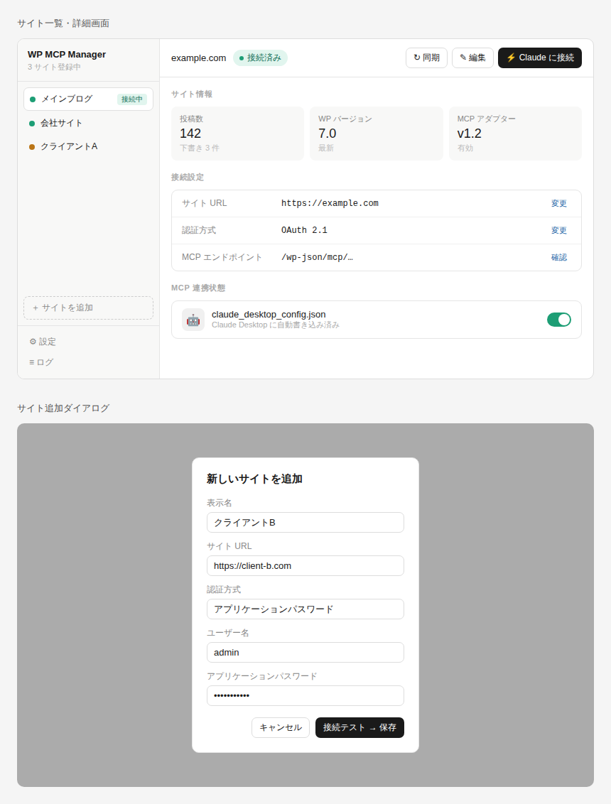

# WP MCP Manager 機能仕様書

**Version 1.2 / 2026年6月**
WordPress × Claude Desktop MCP 統合管理ツール

---

## 目次

1. [概要・目的](#1-概要目的)
2. [システム構成](#2-システム構成)
3. [技術スタック](#3-技術スタック)
4. [必要な外部コンポーネント・URL](#4-必要な外部コンポーネントurl)
5. [機能仕様](#5-機能仕様)
6. [データ設計](#6-データ設計)
7. [セキュリティ要件](#7-セキュリティ要件)
8. [UI 画面構成](#8-ui-画面構成)
9. [Claude Desktop からの記事操作ワークフロー](#9-claude-desktop-からの記事操作ワークフロー)
10. [開発フェーズ計画](#10-開発フェーズ計画)
11. [制約・注意事項](#11-制約注意事項)
12. [料金プラン（フリーミアム）](#12-料金プランフリーミアム)

---

## 1. 概要・目的

WP MCP Manager は、複数のセルフホスト型 WordPress サイトを Claude Desktop から自然言語で操作するための、ローカルインストール型デスクトップアプリケーションである。

本アプリは MCP（Model Context Protocol）の設定・管理を GUI で提供し、ユーザーが設定ファイルを直接編集することなく、以下の操作を Claude Desktop から自然言語で実行できる環境を構築する。

- キーワード・テーマ指定による WordPress 記事の下書き生成
- 生成記事の推敲・改善・SEO 最適化
- 複数 WordPress サイトへの切り替え投稿・公開
- 記事内容に合わせたアイキャッチ画像の AI 生成と設定

### 1.1 解決する課題

従来の WordPress 記事作成フローでは、AI ツールで生成したテキストを手動でコピー＆ペーストし、複数サイトへの投稿には都度ダッシュボードへのログインが必要だった。本アプリは Claude Desktop と WordPress の直接連携を実現し、これらの手作業を自然言語による一連の会話で置き換える。

### 1.2 動作環境

| 項目 | 要件 |
|------|------|
| 対応 OS | macOS 12 以上 / Windows 10 以上 |
| Node.js | v22 以上（必須） |
| Claude Desktop | Pro プラン以上を推奨・前提（安定運用・接続上限回避のため。ローカル MCP 自体は無料プランでも動作する） |
| WordPress | セルフホスト型、バージョン 6.9 以上推奨 |
| インターネット接続 | WordPress サイトへのアクセスが可能なこと |

---

## 2. システム構成

### 2.1 全体アーキテクチャ

本システムは以下の 4 コンポーネントから構成される。

```
[ユーザー]
    │ 自然言語で指示
    ▼
[Claude Desktop]
    │ MCP プロトコル
    ▼
[mcp-wordpress-remote]  ← npx で自動起動（本アプリが設定）
    │ WordPress REST API
    ▼
[WordPress サイト + mcp-adapter プラグイン]
    ▲
    │ サイト登録・設定ファイル自動生成
[WP MCP Manager（本アプリ / Electron）]
```

**各コンポーネントの役割:**

- **WP MCP Manager（本アプリ）** — GUI でサイト設定を管理し、Claude Desktop の設定ファイルを自動生成する
- **Claude Desktop** — 自然言語でユーザーの指示を受け付け、MCP ツールを呼び出す
- **mcp-wordpress-remote** — Claude Desktop の MCP クライアントとして WordPress REST API を仲介するプロキシ
- **WordPress + mcp-adapter プラグイン** — 各サイト側で MCP エンドポイントを公開する

### 2.2 データフロー

1. ユーザーが WP MCP Manager でサイト情報（URL・認証情報）を登録する
2. アプリが `claude_desktop_config.json` を自動生成・更新する
3. Claude Desktop を再起動すると MCP サーバーとして各 WordPress サイトが認識される
4. ユーザーが Claude Desktop で「〇〇サイトに××の記事を書いて投稿して」と指示する
5. Claude Desktop が mcp-wordpress-remote 経由で WordPress REST API を呼び出す
6. 記事の作成・下書き保存・公開が自動で実行される

---

## 3. 技術スタック

| レイヤー | 採用技術 | 用途 |
|----------|----------|------|
| デスクトップ基盤 | Electron（最新安定版） | クロスプラットフォーム対応デスクトップアプリ |
| フロントエンド | React（最新安定版）+ TypeScript | GUI 実装 |
| UI コンポーネント | shadcn/ui + Tailwind CSS v4 | 統一デザインシステム |
| 設定ファイル管理 | electron-store | サイト設定の永続化（JSON） |
| 認証情報管理 | Electron safeStorage | OS のキーチェーン由来の鍵で暗号化し electron-store に保存 |
| HTTP クライアント | Node.js 標準 fetch（v22 内蔵） | WordPress REST API 疎通確認・MCP initialize（追加依存なし） |
| ビルド・配布 | electron-builder | Mac（dmg・公証）/ Windows（NSIS・Azure Artifact Signing 署名）インストーラ生成。いずれも GitHub Releases で配布 |
| MCP プロキシ | @automattic/mcp-wordpress-remote | Claude Desktop ↔ WordPress 仲介 |
| 国際化 | react-i18next（i18next） | UI 文字列のロケールリソース管理（初期 ja、将来多言語化） |
| テーマ | Tailwind CSS ダークモード（class 戦略） | Light / Dark / System の切替 |

---

## 4. 必要な外部コンポーネント・URL

### 4.1 WordPress プラグイン（各サイトへ導入）

各セルフホスト WordPress に以下のプラグインを導入することで、MCP エンドポイントが有効になる。

#### WordPress MCP Adapter（公式・必須）

WordPress コアチームが開発する公式の MCP アダプター。Abilities API と MCP プロトコルを橋渡しする。

- GitHub: https://github.com/WordPress/mcp-adapter
- WordPress 6.9 以降の Abilities API が必要。WordPress 7.0 以降を推奨。

**導入手順:**

1. GitHub からプラグインをダウンロードするか、Composer でインストールする
2. `wp-content/plugins/` に配置して有効化する
3. WordPress 管理画面 → 設定 → MCP Settings で MCP 機能を有効化する

#### AI Engine（推奨・アイキャッチ画像生成に必要）

Meow Apps 製プラグイン。AI 画像生成・MCP 連携・SEO 機能を提供する。アイキャッチ画像の自動生成に使用する。

- 公式サイト: https://meowapps.com/plugin/ai-engine/
- WordPress プラグインディレクトリ: https://wordpress.org/plugins/ai-engine/
- 画像生成には別途 OpenAI API キーが必要

### 4.2 npm パッケージ（実行時に npx で取得）

本アプリが参照するパッケージ。アプリにはバンドルせず、Claude Desktop が起動時に `npx` で取得・実行する（ユーザーの手動インストールは不要）。GPL ライセンスのためアプリへ同梱しない（[12.3](#123-ライセンス整合)）。

#### @automattic/mcp-wordpress-remote（必須）

Claude Desktop と WordPress の間を仲介するプロキシ。`npx` 経由で自動起動される。

- GitHub: https://github.com/Automattic/mcp-wordpress-remote
- npm: https://www.npmjs.com/package/@automattic/mcp-wordpress-remote

#### 参考：旧版リポジトリ

Automattic の旧実装。現在は mcp-adapter へ移行済みのため参照のみ。

- GitHub（アーカイブ）: https://github.com/Automattic/wordpress-mcp

### 4.3 Claude Desktop 設定ファイルパス

本アプリが自動で読み書きするファイルのパスは OS によって異なる。

| OS | 設定ファイルパス |
|----|-----------------|
| macOS | `~/Library/Application Support/Claude/claude_desktop_config.json` |
| Windows | `%APPDATA%\Claude\claude_desktop_config.json` |

### 4.4 WordPress 側の事前設定

各 WordPress サイトで以下の設定が必要。

1. mcp-adapter プラグインをインストール・有効化する
2. WordPress 管理画面 → 設定 → MCP Settings で MCP 機能を有効化する
3. ユーザー → プロフィール → アプリケーションパスワードを発行する（Application Password 認証の場合）
4. WordPress REST API が外部からアクセス可能であることを確認する

> **REST API 疎通確認 URL:** `https://your-site.com/wp-json/wp/v2/posts`
> ブラウザで JSON が返れば正常。Wordfence 等のセキュリティプラグインがブロックしている場合は除外設定が必要。

---

## 5. 機能仕様

### 5.1 サイト管理機能

#### 5.1.1 サイト登録

以下の情報を入力フォームで受け付け、登録する。

| フィールド | 必須 | 説明 |
|------------|------|------|
| 表示名 | 必須 | アプリ内および MCP 設定ファイル内でのサイト識別名。`mcpServers` のキーに使用するため一意であること（重複は保存時に弾く。前後空白はトリム） |
| サイト URL | 必須 | 例: `https://example.com`（末尾スラッシュ不要） |
| 認証方式 | 必須 | `Application Password` を既定とする。`JWT` は上級オプション（旧/第三者プラグインが入った環境向け、Phase 2 以降で検出時のみ有効化）。`OAuth 2.1` は非活性（「Phase 3 で対応予定」と表示）。本アプリは認証サーバーを自作せず、エコシステムが提供する方式を消費するに留める（[ADR-0003](../docs/adr/0003-config-manager-boundary.md)） |
| ユーザー名 | 条件付き | Application Password 方式の場合に必須。記事作成専用の **Editor ロール**ユーザーを推奨（下記ヒント参照） |
| アプリケーションパスワード | 条件付き | WordPress 管理画面（ユーザー → プロフィール → アプリケーションパスワード）で発行したもの。ログインパスワードそのものではない |
| MCP エンドポイント | 任意 | 既定 `/wp-json/mcp/mcp-adapter-default-server`。サーバー側スラッグが異なる場合のみ変更する（上級者向け） |
| メモ | 任意 | サイトについての覚書 |

**ユーザー名／アプリケーションパスワード欄のインラインヒント（UI 上に常時表示）:**

> ⚠️ **権限は最小に。** Admin ユーザーは避け、記事作成専用の **Editor ロール**ユーザーを作ってアプリケーションパスワードを発行してください。アプリケーションパスワードは発行元ユーザーのロール権限をそのまま引き継ぐため、Editor ロールなら漏洩時の影響を記事編集の範囲に限定できます。
>
> 🔁 **定期的に再発行を。** アプリケーションパスワードは定期的に再発行してください（推奨: **90 日ごと**）。漏洩が疑われる場合は WordPress 管理画面でその**アプリケーションパスワードのみを即座に取り消し**ます（ログインパスワードの変更は不要）。

> なぜログインパスワードを変えなくてよいか: 接続中に `claude_desktop_config.json` に乗るのはログインパスワードではなく、個別に発行・**個別に失効**できるアプリケーションパスワードだから。漏洩時はそれ1本を取り消せば被害を断てる。

#### 5.1.2 サイト一覧・切り替え

- 登録済みサイトをサイドバーにリスト表示する
- クリックで選択サイトを切り替え、詳細パネルに情報を表示する
- 接続状態をカラーバッジで表示する（緑: 接続中 / 黄: 未確認 / 赤: エラー）。表記は「接続中」に統一する（「接続済み」は使わない）
- ドラッグ&ドロップで表示順を変更できる

#### 5.1.3 サイト編集・削除

- 登録情報の編集は既存フォームに値を読み込んで行う
- 削除時は確認ダイアログを表示し、`claude_desktop_config.json` からも該当エントリを削除する

#### 5.1.4 ブラウザで管理画面を開く

サイト詳細パネル上部のボタン列に「ブラウザでログイン」ボタンを設置する。クリックすると OS の既定ブラウザで該当サイトの WordPress 管理画面 URL（`{サイト URL}/wp-admin/`）を開く。未ログインの場合はログインページへリダイレクトされる。Electron の `shell.openExternal` を使用する。

#### 5.1.5 同期

サイト詳細パネル上部のボタン列に「同期」ボタンを設置する。選択中サイトの WordPress から最新のサマリー（投稿数・下書き数・MCP アダプターバージョン）と接続ステータスを再取得する、**手動・読み取り専用**の操作である。

- 方向は WordPress → アプリであり、`claude_desktop_config.json` への書き込み（接続）とは無関係。UI 上も接続操作と明確に分ける。
- 起動時の手動疎通確認と同系列の機能であり、**Free 機能**とする（バックグラウンドの自動監視のみ Pro）。

### 5.2 Claude Desktop 連携機能

#### 5.2.1 設定ファイルの自動生成・更新

`claude_desktop_config.json` への書き込みは「接続中（`enabled: true`）」のサイトに対してのみ行う（[5.2.3](#523-接続トグルと平文露出の最小化)）。具体的には次のタイミングで更新する。

- **接続（トグル ON）**: 該当サイトのエントリを追加する
- **接続中サイトの編集**: 該当エントリを更新する
- **接続解除（トグル OFF）／削除**: 該当エントリを削除する

> サイトの新規追加・保存だけでは config には書き込まれない（electron-store と safeStorage への保存のみ）。config への反映は接続トグルを ON にした時点で初めて発生する。

接続時に生成される設定の形式は以下の通り。

```json
{
  "mcpServers": {
    "サイト表示名": {
      "command": "npx",
      "args": ["-y", "@automattic/mcp-wordpress-remote@<動作確認済みバージョン>"],
      "env": {
        "WP_API_URL": "https://your-site.com/wp-json/mcp/mcp-adapter-default-server",
        "WP_API_USERNAME": "your-username",
        "WP_API_PASSWORD": "xxxx xxxx xxxx xxxx",
        "OAUTH_ENABLED": "false",
        "WP_MCP_MANAGER_ID": "<内部 uuid・自社エントリ識別用>"
      }
    }
  }
}
```

> 既存の `mcpServers` エントリ（他の MCP サーバー設定）は保持したまま、WordPress サイトのエントリのみを追加・更新・削除する。

**書き込みの堅牢性・運用方針:**

- **WP_API_URL の構成**: `WP_API_URL` は「サイト URL ＋ `mcpEndpoint`（既定スラッグ `mcp-adapter-default-server`）」で組み立てる。
- **アトミック書き込み**: 一時ファイルへ書き出してから rename し、書き込み中断による破損を防ぐ。書き込み前に `.bak` を 1 世代保持する。
- **破損時の保護**: 既存 JSON のパースに失敗した場合は上書きせず中断し、警告を表示する（他の MCP 設定の破壊を防ぐ）。
- **自社エントリの識別**: 本アプリが書き込んだサイトは、表示名に依存せず各エントリの `env` 内に隠しマーカー `WP_MCP_MANAGER_ID: <内部 uuid>` を埋めて識別する。改名・削除・他アプリ設定の保持は、このマーカーで自社エントリを特定して行う（[ADR-0001](../docs/adr/0001-site-identity-in-claude-config.md)）。マーカーをエントリ直下ではなく `env` 内に置くのは、Claude Desktop のスキーマ検証で未知キーが弾かれるリスクを避けるため。
- **キー名・衝突チェック**: `mcpServers` のキーにはサイトの表示名を使用する（一意・トリム済み）。一意性は**アプリ内のサイト間に加え、`claude_desktop_config.json` 内の既存キー全体**に対しても検証し、他の MCP サーバーのキーと衝突する場合は接続をブロックして警告する（既存エントリの上書き破壊を防ぐ）。接続中サイトの改名時は「旧キー削除 ＋ 新キー追加」として扱い、再起動を促す。
- **バージョン固定**: `@latest` ではなく動作確認済みバージョンをピン留めして書き込む（不良リリースによる全サイト一斉故障を防ぐ）。使用バージョンはアプリ設定で管理し、将来アプリ側で更新を通知する。
- **設定ファイル不在時**: `claude_desktop_config.json`／ディレクトリが存在しない場合は `{ "mcpServers": {} }` から新規作成する。Claude Desktop 本体が未検出の場合は警告を表示するが、保存・接続操作自体はブロックしない（後からインストールするケースを許容）。

#### 5.2.2 Claude Desktop 再起動通知

接続・接続解除・接続中サイトの編集により `claude_desktop_config.json` を更新した後、「Claude Desktop を再起動してください」というトースト通知を表示する。再起動ボタンを提供し、クリックで Claude Desktop を自動再起動できることが望ましい（自動再起動は Pro 機能）。

**自動再起動の安全策:**

- 自動再起動はプロセスを kill して再起動するため**進行中の会話を中断しうる**。実行前に必ず「Claude Desktop の進行中の会話が中断されます。再起動しますか？」という確認ダイアログを挟む。無確認の即時再起動はしない。
- バックグラウンドで勝手に再起動はしない。ユーザーがボタンを押したときだけ再起動する。
- 短時間に複数サイトを接続/解除した場合、再起動通知はデバウンスして**まとめて 1 回**にする（操作ごとに促さない）。

#### 5.2.3 接続トグルと平文露出の最小化

各サイトは「接続中 / 接続解除」の状態（`enabled`）を持ち、サイト詳細パネルのトグルで切り替える。

- **接続（トグル ON）**: `claude_desktop_config.json` に該当サイトの `env`（Application Password を含む）を書き込み、`connectedAt` を記録する。config に書いただけでは Claude Desktop は読み込まないため、再起動するまでは「**接続中（再起動待ち）**」、再起動後に「**接続中（反映済み）**」となる。本アプリは Claude Desktop の再起動を確実に検知できないため、反映済み判定はユーザーの再起動操作を目印にしたベストエフォートとし、UI には少なくとも「要再起動」を明示する。
- **接続解除（トグル OFF）**: `claude_desktop_config.json` から該当エントリを削除する。マスターの認証情報は OS キーチェーン側（safeStorage）に残るため、再接続はワンクリックで行える。

**平文露出についての正確な整理:** 公式 mcp-adapter の標準構成では Application Password が現実的な唯一の認証手段であり、接続中は `claude_desktop_config.json` に平文で存在する。JWT/OAuth による回避は追加プラグイン導入が前提となるため、本アプリの想定構成では前提にしない（[ADR-0003](../docs/adr/0003-config-manager-boundary.md)）。本アプリはこの平文の露出時間を最小化するため、上記トグルで「使うときだけ」書き出す方針をとる（消去そのものは保証しない）。

**アンインストール時の平文残留対策:** 接続中のままアプリを削除すると平文が config に残留しうる。対策は OS で非対称とする（[ADR-0005](../docs/adr/0005-plaintext-cleanup-on-uninstall.md)）。Windows は NSIS アンインストーラのフックで自社エントリ（`env.WP_MCP_MANAGER_ID` で識別）を確認のうえ削除する。macOS は .app のゴミ箱削除にフックを掛けられないため、設定画面に「すべて接続解除してアンインストール準備」操作を用意し、ヘルプに「アンインストール前に全接続解除を」を明記する（24h 接続継続警告が事実上の保険となる）。

- **接続解除 = ディスク上の平文を即削除**、**Claude Desktop の再起動 = 起動済み MCP プロセスのメモリ上の認証情報も消去**、の二段で完全にクリアされる。接続解除時は「使用が完了した場合は接続を解除し、Claude Desktop を再起動してください」という警告を表示する。
- 接続継続時間が設定値（デフォルト 24 時間）を超えたサイトには、サイトごとに「接続したまま長時間経過しています。使用が完了していれば接続解除を推奨します」という警告を表示する（自動削除はしない）。アプリケーションパスワードの発行から長期間（目安 90 日）経過しているサイトには、あわせて再発行（ローテーション）を促す。

### 5.3 接続テスト・ステータス機能

#### 5.3.1 接続テスト

- サイト登録・編集時に「接続テスト」ボタンを提供する
- WordPress REST API（`/wp-json/wp/v2/posts`）に GET リクエストを送信し、レスポンスを確認する
- MCP エンドポイント（`/wp-json/mcp/mcp-adapter-default-server`）に対し MCP の `initialize` ハンドシェイクを実行し、エンドポイントの有効性と `serverInfo.version`（MCP アダプターバージョン）を取得する
- テスト結果（成功 / 失敗・エラー内容）をインラインで表示する
- 接続トグル ON（config 書き込み）時は接続テスト成功を**推奨**とする（必須ではない）。テスト未実施/失敗のまま接続しようとした場合は「壊れた設定を Claude Desktop に書き込む可能性があります」という確認ダイアログを挟む

#### 5.3.2 ステータス監視

- アプリ起動時に全登録サイトへ疎通確認を実行する
- 一定間隔（デフォルト 30 分）でバックグラウンド疎通確認を実行する
- エラーが発生した場合はバッジを赤に変更し、システムトレイ通知を出す

### 5.4 設定・ログ機能

#### 5.4.1 アプリ設定

| 設定項目 | デフォルト値 | 説明 |
|----------|-------------|------|
| 疎通確認間隔 | 30 分 | バックグラウンド接続チェックの頻度 |
| 起動時に疎通確認 | 有効 | アプリ起動時に全サイトをチェックするか |
| システムトレイに常駐 | 有効 | ウィンドウを閉じてもバックグラウンドで動作するか |
| ログ保存日数 | 7 日 | 操作ログを保持する日数 |
| 接続継続の警告閾値 | 24 時間（OFF 可） | 接続したまま経過したサイトに解除を促す警告を出すまでの時間 |
| テーマ | System | 表示テーマ（Light / Dark / System） |

#### 5.4.2 操作ログ

- サイトの追加・編集・削除、接続テスト結果、設定ファイルの更新日時を記録する
- ログ画面でフィルタリング・検索が可能
- CSV エクスポート機能を提供する

---

## 6. データ設計

### 6.1 サイト設定データ（electron-store で保存）

認証情報を除いた設定を JSON 形式でローカルに保存する。

```json
{
  "sites": [
    {
      "id": "uuid-v4",
      "name": "メインブログ",
      "url": "https://example.com",
      "authMethod": "application_password",
      "username": "admin",
      "mcpEndpoint": "/wp-json/mcp/mcp-adapter-default-server",
      "memo": "メモ欄",
      "order": 0,
      "enabled": false,
      "connectedAt": null,
      "secretUpdatedAt": "2026-06-25T00:00:00Z",
      "createdAt": "2026-06-25T00:00:00Z",
      "updatedAt": "2026-06-25T00:00:00Z"
    }
  ]
}
```

> `secretUpdatedAt` はアプリケーションパスワードを最後に入力/変更した日時。ローテーション推奨（目安 90 日・[7章](#7-セキュリティ要件)）の経過判定に使う。一般の `updatedAt`（任意の編集で更新）とは別に、認証情報の更新時のみ更新する。

### 6.2 認証情報（Electron safeStorage で暗号化保存）

アプリケーションパスワードは平文で保存しない。Electron の `safeStorage`（OS のキーチェーン由来の鍵で暗号化。macOS は Keychain、Windows は DPAPI を利用）で暗号化し、暗号文を electron-store に保存する。

```javascript
// 保存（暗号文を Base64 で electron-store に格納）
const encrypted = safeStorage.encryptString(applicationPassword) // Buffer
store.set(`secrets.${site.id}`, encrypted.toString("base64"))

// 取得
const buf = Buffer.from(store.get(`secrets.${site.id}`), "base64")
const applicationPassword = safeStorage.decryptString(buf)
```

> 接続中は同じパスワードが `claude_desktop_config.json` に平文で書き出される。これは公式 mcp-adapter の標準構成（Application Password）では現実的に避けられない（JWT/OAuth は追加プラグイン前提のため本アプリは前提にしない・[ADR-0003](../docs/adr/0003-config-manager-boundary.md)）。[5.2.3](#523-接続トグルと平文露出の最小化) の接続トグルで露出時間を最小化する。

---

## 7. セキュリティ要件

| 項目 | 対応方針 |
|------|----------|
| 認証情報の保存 | Electron safeStorage で暗号化し electron-store に保存（OS キーチェーン由来の鍵）。平文での保存は禁止 |
| 通信 | HTTPS のみ許可。HTTP のサイト URL は登録時に警告を表示する |
| WordPress 側権限 | **最小権限の原則**。記事作成専用の MCP 用ユーザー（**Editor ロール**）の作成を推奨し、Admin ユーザーでのアプリケーションパスワード発行を避ける。アプリケーションパスワードは発行元ユーザーのロール権限をそのまま引き継ぐため、漏洩時の影響範囲がロールで決まる。サイト追加/編集ダイアログにこの旨をインラインヒントで常時表示する（[5.1.1](#511-サイト登録)） |
| 設定ファイルのパーミッション | `claude_desktop_config.json` のファイルパーミッションを確認し、不要な読み取りを防ぐ |
| 設定ファイル内の平文 | 公式 mcp-adapter の標準構成（Application Password）では、接続中は `claude_desktop_config.json` にパスワードが平文で存在する。接続トグルで露出時間を最小化し、接続解除＋Claude Desktop 再起動で消去する。アンインストール時の残留は [5.2.3](#523-接続トグルと平文露出の最小化) / [ADR-0005](../docs/adr/0005-plaintext-cleanup-on-uninstall.md) の方針で対処する |
| パスワードローテーション | アプリケーションパスワードの定期的な再発行を推奨（**目安 90 日ごと**）。漏洩が疑われる場合は該当アプリケーションパスワードのみを即座に取り消すよう案内する（ログインパスワードの変更は不要）。サイト追加/編集ダイアログのインラインヒント（[5.1.1](#511-サイト登録)）に加え、接続継続が長いサイトへの警告（[5.2.3](#523-接続トグルと平文露出の最小化)）にもローテーション時期の目安を併記する |
| Electron contextIsolation | renderer プロセスから Node.js API に直接アクセスさせない。contextBridge 経由でのみ公開する |

---

## 8. UI 画面構成

### 8.1 メイン画面

左サイドバー + 右メインパネルの 2 カラムレイアウト。

**左サイドバー:**
- アプリ名・バージョン表示
- 登録サイト一覧（カラーバッジ付き）
- サイト追加ボタン
- 設定・ログへのナビゲーション

**右メインパネル（サイト詳細）:**
- サイト名・URL・接続ステータスバッジ
- 上部ボタン列（同期 / 編集 / **ブラウザでログイン** / Claude に接続）
- サイト情報サマリー（投稿数・下書き数・MCP アダプターバージョン・MCP エンドポイント状態）
- 接続設定の表示と編集リンク（URL・認証方式・MCP エンドポイント）
- `claude_desktop_config.json` への反映状態と接続トグル（[5.2.3](#523-接続トグルと平文露出の最小化) の接続/解除）


*図 8-1: メイン画面（左）とサイト追加ダイアログ（右）*

> **モックアップの修正待ち（v1.2 で反映）:** 現行 `mockup.png` には仕様と矛盾する箇所がある。実画像の差し替え時に次を反映する ── (1) 認証方式の表示を「OAuth 2.1」→「Application Password」、(2)「WP バージョン 7.0」カードを削除し「MCP エンドポイント状態」カードに差し替え（11.2：WP コアバージョンは標準 REST で取得不能のため非表示）、(3) ステータスバッジ表記を「接続済み」→「接続中」に統一、(4) 接続中サイトには「要再起動」サブ状態を表示。サマリーは「投稿数 / 下書き数 / MCP アダプターバージョン」を基本構成とする。

### 8.2 サイト追加 / 編集ダイアログ

- モーダルダイアログ形式
- 入力フィールド: 表示名・サイト URL・認証方式・ユーザー名・アプリケーションパスワード・メモ
- **「接続テスト」と「保存」は分離する**。接続テストは任意の確認手段であり、テスト失敗/未実施でも警告を表示したうえで保存は可能（バッジは「黄: 未確認」または「赤: エラー」になる）。サイトが一時的にダウン・WP プラグイン未導入・Wordfence でブロック等、環境要因で保存を止めない（5.2.1 の「環境要因でブロックしない」方針と整合）。
- 「キャンセル」ボタン

> 「保存」はサイト情報を electron-store と safeStorage に保存するのみで、この時点では `claude_desktop_config.json` には書き込まれない（＝まだ接続されない）。Claude Desktop へ反映するには、保存後に詳細パネルの接続トグルを ON にする（[5.2.3](#523-接続トグルと平文露出の最小化)）。

### 8.3 設定画面

- 疎通確認間隔の設定
- 接続継続の警告閾値の設定（デフォルト 24 時間 / OFF 可）
- テーマ切替（Light / Dark / System）
- システムトレイ常駐の ON/OFF
- ログ保存日数の設定
- `claude_desktop_config.json` のファイルパス表示と「ファイルを開く」ボタン

### 8.4 ログ画面

- 操作履歴の一覧表示（日時・種別・対象サイト・結果）
- サイト・種別によるフィルタリング
- CSV エクスポートボタン

### 8.5 共通 UI 方針

- **ダークモード**: Tailwind CSS の `class` 戦略でテーマを切り替える。初期値は OS 設定に追従（System）、設定画面で Light / Dark / System を選択できる。配色は shadcn のデザイントークン（CSS 変数）で Light / Dark 両テーマを定義する。
- **国際化（i18n）**: UI 文字列はハードコードせず、`react-i18next` のロケールリソース（JSON）に外出しする。Phase 1 の表示言語は日本語（`ja`）のみだが、将来 `en` 等を追加するだけで切替できる構成とする。日付・数値は `Intl` 経由でフォーマットを一元化する。言語切替 UI は Phase 3 以降で追加する。

---

## 9. Claude Desktop からの記事操作ワークフロー

本アプリのセットアップ完了後、ユーザーは Claude Desktop から以下のような自然言語で WordPress を操作できる。

### 9.1 記事の下書き作成

```
"メインブログ" に、「初めての登山｜持ち物リストと準備の心得」という
タイトルで 2000 字程度の記事を書いて下書き保存してください。
カテゴリは「アウトドア」、タグは「登山、初心者、準備」で。
```

### 9.2 推敲・改善

```
"メインブログ" の直前の下書き記事を読んで、
SEO の観点から見出し構成と導入文を改善してください。
```

### 9.3 別サイトへの投稿

```
同じ内容を "会社サイト" 向けに若干フォーマルなトーンに書き直して、
カテゴリ「社員ブログ」で下書き保存してください。
```

### 9.4 アイキャッチ画像の生成と設定

AI Engine プラグインが導入済みの場合:

```
"メインブログ" の「初めての登山」記事に合うアイキャッチ画像を生成して設定してください。
山と朝日、ハイカーのシルエットをイメージした横長の写真風で。
```

### 9.5 公開

```
"メインブログ" の「初めての登山」下書き記事を確認して、
問題なければ公開してください。
```

---

## 10. 開発フェーズ計画

| フェーズ | 内容 | 優先度 |
|---------|------|--------|
| Phase 1（コア） | Electron アプリ基盤構築、サイト登録・編集・削除 UI、`claude_desktop_config.json` の自動生成・更新、Application Password 認証（認証方式で分岐する設計／JWT・OAuth は後続フェーズ）、safeStorage による認証情報保存、接続トグル（接続/解除＋再起動警告・再起動待ち/反映済みサブ状態）、同期（サマリー再取得）、ブラウザで管理画面を開く、接続テスト機能、i18n 基盤（ja のみ）、ダークモード対応、エンタイトルメント判定の**構造**（Free/Pro ゲートを単一の入口に通す設計）。**上限・機能ロックの強制（enforcement）は Phase 1 では行わず、全機能アンロックで提供する**（[ADR-0004](../docs/adr/0004-entitlement-gate-deferred-enforcement.md)） | 最高 |
| Phase 2（UX 向上） | サイドバーのリアルタイムステータス表示、バックグラウンド疎通確認、システムトレイ常駐、接続継続時間の警告、操作ログ機能 | 高 |
| Phase 3（拡張） | OAuth 2.1 認証対応（セルフホストでは別途 OAuth プロバイダプラグインの導入が前提）、AI Engine / 画像生成 MCP の設定サポート、記事テンプレート管理、言語切替 UI（多言語化）、Stripe 課金・ライセンス検証・Free/Pro エンタイトルメント有効化（上限・機能ロックの enforcement をこのタイミングで ON。課金開始前からの初期ユーザーは無償 Pro として据え置く＝grandfather・[ADR-0004](../docs/adr/0004-entitlement-gate-deferred-enforcement.md)） | 中 |
| Phase 4（配布） | GitHub Actions で Mac（公証 / notarytool）・Windows（NSIS / Azure Artifact Signing 署名）をビルドし、GitHub Releases で配布。自動更新は electron-updater で Mac・Windows 共通。Azure Artifact Signing は Basic 月 $9.99（対象国に Canada 個人を含む） | 低 |

---

## 11. 制約・注意事項

### 11.1 MCP の制約

- MCP は Claude Desktop（デスクトップアプリ）でのみ動作する。ブラウザ版 Claude.ai では利用不可。
- Claude Desktop の再起動なしに設定変更は反映されない。設定更新後は必ず再起動が必要。
- MCP を通じたファイルシステム操作（プラグインのインストール等）は WordPress REST API 経由では実行できない。WP-CLI または SSH を別途使用する必要がある。

### 11.2 WordPress 側の制約

- WordPress 6.9 以上が必要（Abilities API の導入バージョン）。
- セルフホストの mcp-adapter は OAuth 2.1 認可サーバーを内蔵しない。OAuth を使う場合は別途 OAuth プロバイダプラグインの導入が必要。OAuth 2.1 がプラグインなしで使えるのは WordPress.com ホスティングのみ。**標準で確実に使えるのは Application Password**。JWT は公式 mcp-adapter には発行機能がなく、旧 `wordpress-mcp` プラグインや第三者の JWT 認証プラグインに依存するため、本アプリでは上級オプション扱いとする（[ADR-0003](../docs/adr/0003-config-manager-boundary.md)）。
- WordPress コアバージョンは REST API の標準仕様では公開されないため、サマリーには表示しない。プラグイン/テーマの「更新が必要な数」も標準 REST では取得できない（更新有無のフィールドが存在せず、取得には管理者権限が必要なため Editor ロール推奨の方針とも矛盾する）ため、表示しない。
- Wordfence 等のセキュリティプラグインが REST API をブロックしている場合、接続テストが失敗する。除外設定が必要。
- マルチサイト構成の WordPress では、サイトごとに個別のエンドポイントを設定する必要がある。

### 11.3 Claude Desktop の制約

- ローカル MCP（`claude_desktop_config.json` 経由）自体は無料プランでも動作するが、本アプリは安定運用・接続上限回避の観点から Claude Desktop の Pro プラン以上を前提・推奨とする。
- `claude_desktop_config.json` に登録した MCP サーバー名（表示名）が Claude Desktop 内でのサイト識別名になるため、わかりやすい名前をつけることを推奨する。

### 11.4 AI 生成コンテンツの取り扱い

- AI が生成した記事は必ず人間がレビューしてから公開することを推奨する。「下書き保存 → 確認 → 公開」のフローが安全。
- AI Engine でのアイキャッチ画像生成には OpenAI API キー等の別途設定が必要になる場合がある。

### 11.5 設定ファイルの書き込み権限・プラットフォーム考慮

`claude_desktop_config.json` はユーザーのホーム/プロファイル配下にあるユーザー所有ファイルであり、本アプリはユーザー権限で読み書きする。**管理者昇格（UAC / sudo）は不要**。

- **macOS**: 配布は Developer ID 署名＋公証（Mac App Store ではない）＝サンドボックス無しのため、`~/Library/Application Support/Claude/` へ直接書き込める。`Application Support` は TCC 保護対象外で同意ダイアログも出ない。※Mac App Store で配布するとサンドボックスにより書き込めないため採用しない。
- **Windows**: Microsoft Store（MSIX）はファイルシステム仮想化により、他アプリの `%APPDATA%` への書き込みが自分専用領域へリダイレクトされ Claude Desktop から見えない。このため **Store ではなく署名済み NSIS インストーラ（フルトラスト Win32）で配布**し、`%APPDATA%\Claude\` へ直接書き込む。
- **コード署名（Windows）**: Azure Artifact Signing（旧 Trusted Signing、Basic 月 $9.99、Canada 個人は対象）を使用。electron-builder が対応。SmartScreen の信頼はダウンロード実績で蓄積されるため、配布初期は警告が出ることがある。

---

## 12. 料金プラン（フリーミアム）

本アプリはクローズドソースの proprietary アプリとして配布し、機能ゲート型フリーミアムで提供する（広告は表示しない）。セキュリティ機能（safeStorage 暗号化・平文露出の最小化・HTTPS 警告）は有料ゲートの対象外とし、Free でも常に利用できる。

### 12.1 Free / Pro 機能分割

| 機能 | Free | Pro（年 $10） |
|------|:----:|:-------------:|
| 登録サイト数 | 3 件まで | 無制限 |
| Application Password 認証 | ✅ | ✅ |
| config 自動生成・接続トグル（平文最小化含む） | ✅ | ✅ |
| 接続テスト（REST＋MCP initialize） | ✅ | ✅ |
| ブラウザでログイン | ✅ | ✅ |
| safeStorage 暗号化・HTTPS 警告等のセキュリティ | ✅ | ✅ |
| 90 日アプリパスワード・ローテーション警告 | ✅ | ✅ |
| ダークモード / 多言語基盤 | ✅ | ✅ |
| サイト情報サマリー | ✅ | ✅ |
| 起動時の手動疎通確認 | ✅ | ✅ |
| 操作ログ（直近 7 日の閲覧） | ✅ | ✅ |
| バックグラウンド自動監視＋トレイ通知 | — | ✅ |
| Claude Desktop ワンクリック自動再起動 | — | ✅ |
| 24h 接続継続の自動警告 | — | ✅ |
| 操作ログの CSV エクスポート＋長期保持 | — | ✅ |
| 記事テンプレート管理（Phase 3） | — | ✅ |
| OAuth 2.1 認証（Phase 3） | — | ✅ |
| AI Engine / 画像生成 MCP の設定サポート（Phase 3） | — | ✅ |
| 複数 config プロファイル・設定の書出/取込（将来） | — | ✅ |

**分割の考え方:** サイト数（3 → 無制限）を主軸のゲートとし、個人ブロガーは無料で完結、複数クライアントを扱うフリーランス/制作会社が自然に Pro へ移行する。自動化（バックグラウンド監視・自動再起動）と監査（CSV ログ）を Pro に寄せる。セキュリティ機能は信頼維持のため全 Free。

### 12.2 課金・ライセンス

- **決済**: Stripe Billing の年額サブスクリプション（Pro：年 $10）。
- **ライセンス発行**: 決済成功時に署名付きエンタイトルメント・トークン（有効期限入り）を発行する。
- **検証**: オフライン耐性型。トークンをローカルにキャッシュし、起動時にオンラインなら再検証、オフライン時は猶予期間内で動作を継続する。
- **エンタイトルメント判定**: 各機能の入口を単一のゲートに通す。Phase 1 から判定の**構造**を組み込むが、上限・機能ロックの**強制は行わず全機能アンロックで提供**する。Phase 3 で Stripe 課金を有効化するのと同時に enforcement を ON にする。課金開始前からの初期ユーザーは無償 Pro として据え置く（grandfather）。降格は行わない。grandfather 対象の判定基準は Phase 3 の課金設計時に確定する（[ADR-0004](../docs/adr/0004-entitlement-gate-deferred-enforcement.md)）。
- **税務**: Stripe は Merchant of Record ではないため、デジタル販売の VAT/GST は自己対応（Stripe Tax の併用を検討）。カナダ個人での販売開始前に確認する。

### 12.3 ライセンス整合

- 自社が依存する npm パッケージ（Electron / React / shadcn-ui 等）はすべて MIT / Apache-2.0 / ISC 等の寛容ライセンスで、商用・クローズド配布が可能。`NOTICES`（third-party ライセンス一覧）をアプリに同梱する。
- GPL ライセンスのコンポーネント（`@automattic/mcp-wordpress-remote`、WordPress 側プラグイン）はアプリに**同梱せず**、実行時 npx 取得・ユーザー側サーバー導入とすることで、proprietary 本体へコピーレフトを波及させない。
- **商標**: WordPress / Claude / Automattic との非公式・非提携を明記する。製品名・マーケティングは各ブランドガイドラインに従い、公式提携の誤認を避ける。
- 商用化前に弁護士によるレビューを行う。

---

*WP MCP Manager 機能仕様書 v1.1 — 以上*
